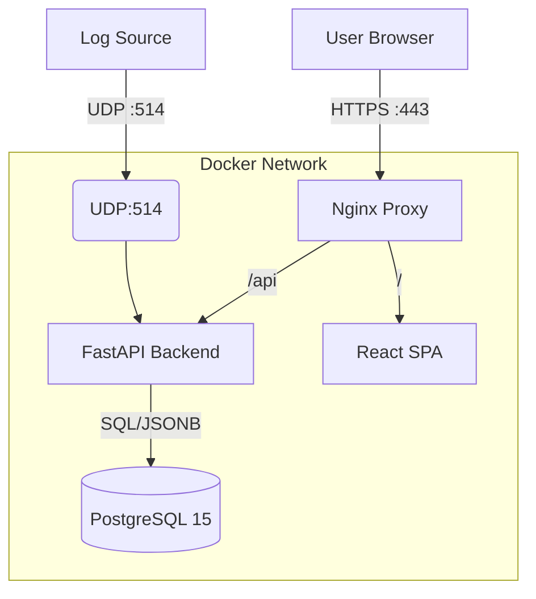

# Log Management Appliance

A high-performance, single-appliance log management solution designed for real-time telemetry, search, and visualization.

## System Architecture

The system runs as a containerized appliance managed by Docker Compose.



### Components
1.  **Backend (FastAPI)** (`/backend`):
    *   **Role**: Ingestion & Query Engine.
    *   **Ingestion**: Listens on UDP Port 514 (Syslog) and HTTP `POST /ingest`.
    *   **Auth**: Enforced via `X-API-Key` header for ingestion.
    *   **Performance**: Uses direct `psycopg2` for optimized bulk inserts.
2.  **Database (PostgreSQL)** (`/db`):
    *   **Schema**: `logs` table with `JSONB` for flexible `raw_data`.
    *   **Indexing**: GIN Index on `raw_data` for sub-millisecond JSON field searches.
    *   **Partitioning**: Ready for time-based partitioning (future).
3.  **Frontend (React)** (`/frontend`):
    *   **Framework**: Vite + React + Tailwind CSS.
    *   **Theme**: "Neon Terminal" (Cyberpunk/Dark Mode).
    *   **Features**: Real-time Summary Cards, Log Table with Detail View, Severity Visualization.
    *   **Testing**: Vitest + React Testing Library integration.
4.  **Reverse Proxy (Nginx)**:
    *   Serves static frontend assets.
    *   Proxies API requests (`/api/*`) to the backend.
    *   Single entry point (Port 80) for the dashboard.

## Tech Stack

### Backend
*   **Language**: Python 3.11
*   **Framework**: FastAPI (ASGI)
*   **Parsing**: Pydantic (Validation) + Custom Syslog Parser
*   **DB Driver**: `psycopg2-binary`

### Frontend
*   **Build Tool**: Vite
*   **Library**: React 18
*   **Styling**: Tailwind CSS v3
*   **Icons**: Lucide React
*   **Charts**: Recharts

### DevOps
*   **Containerization**: Docker & Docker Compose
*   **CI/CD**: GitHub Actions (Pytest + Vitest)
*   **Testing**: `pytest` (Backend), `vitest` (Frontend)

## Getting Started

### Prerequisites
*   Docker & Docker Compose

### Running the Appliance
1.  **Start the stack**:
    ```bash
    docker-compose up --build -d
    ```
2.  **Access the Dashboard**:
    *   Open `http://localhost`
3.  **Send Logs**:
    *   **Syslog (UDP)**: Send to `localhost:514`
    *   **HTTP**: POST to `http://localhost/ingest/http` with header `X-API-Key: secret-key-123` ***Not real API-key***

## Testing

### Running Tests
*   **Frontend**: `cd frontend && npm test`
*   **Backend**: `cd backend && pytest`
*   **CI**: Automatically runs on push via `.github/workflows/ci.yml`.

## API Documentation
Once running, full Swagger UI is available at: `http://localhost:8000/docs` (proxied via `/api/docs` if configured, otherwise port 8000 directly during dev).
